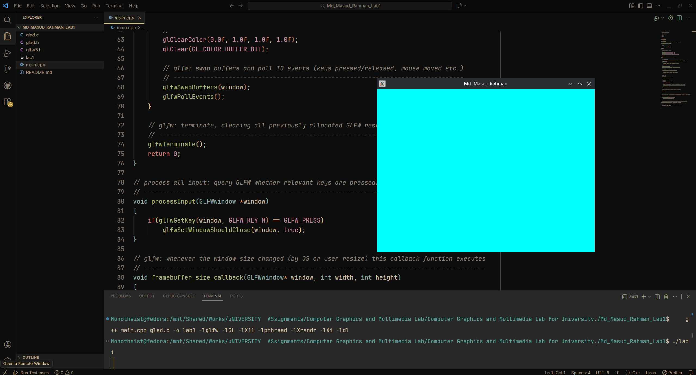

# Lab Assignment 1

**Description:**  
Create a cyan colored window containing your full name as the window name. If the user presses the keyboard's key corresponding to the first letter of their name (M), the window closes.

## Output

