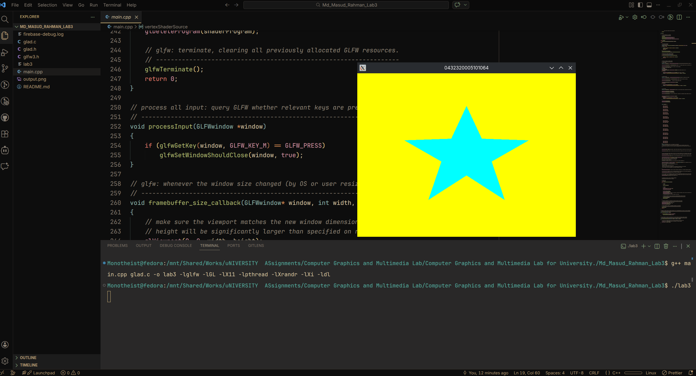

# Lab Assignment 3

**Description:**  
/* Instructions as previous, submit link to main.cpp file, attach necessary screenshots like previous one*/

    Draw One Cyan Colored Star (built only with triangles) with yellow background 

   Window name -> your full ID, Turns the window off by pressing your name's initial letter.

## Output

